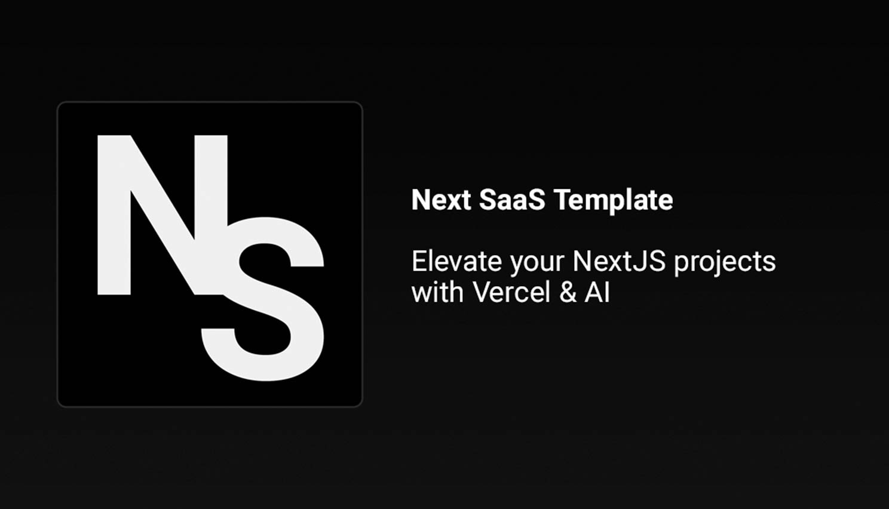

<a href="https://next-saas-template.vercel.app">
  
  <h1 align="center">Next SaaS Stripe Starter</h1>
</a>

<p align="center">
  Start at full speed with SaaS Starter !
</p>

<p align="center">
  <a href="https://twitter.com/SaasTemplate">
    
  </a>
</p>

<p align="center">
  <a href="#introduction"><strong>Introduction</strong></a> ·
  <a href="#installation"><strong>Installation</strong></a> ·
  <a href="#tech-stack--features"><strong>Tech Stack + Features</strong></a> ·
  <a href="#author"><strong>Author</strong></a> ·
  <a href="#credits"><strong>Credits</strong></a>
</p>
<br/>

## Introduction

Empower your next project with the stack of Next.js 14, Prisma, PostgreSQL, Auth.js v5, Resend, React Email, Shadcn/ui, and Stripe.
<br/>
All seamlessly integrated with the SaaS Starter to accelerate your development and saas journey.

## Installation

Clone & create this repo locally with the following command:

```bash
npx create-next-app my-saas-project --example "https://github.com/johanguse/next-saas-template"
```

1. Install dependencies using pnpm:

```sh
pnpm install
```

2. Copy `.env.example` to `.env.local` and update the variables.

```sh
cp .env.example .env.local
```

3. Start the development server:

```sh
pnpm dev
```

### Extra

In case you need to change the database and seed again, use this command:

```sh
prisma generate && prisma db push --force-reset && pnpm prisma:seed && next build
```

Replace the at Vercel the default Build Command to this above

> [!WARNING]  
> You need update `.react-email` folder before use `pnpm run email`. Check the link [here](https://github.com/resend/react-email/issues/868#issuecomment-1828411325) if you have the error : `renderToReadableStream not found`
>
> You can't use turbo mode to sent react-email. Check the issue [here](https://github.com/resend/resend-node/issues/258)
> So if you are developer the emails use the command `pnpm run dev` if you are not you can use `pnpm run dev:turbo`

## Roadmap

Visit our [Public Roadmap](https://bit.ly/48LTNin) for more

## Tech Stack + Features

### Frameworks

- [Next.js](https://nextjs.org/) – React framework for building performant apps with the best developer experience
- [Auth.js](https://authjs.dev/) – Handle user authentication with ease with providers like Google, Twitter, GitHub, etc.
- [Prisma](https://www.prisma.io/) – Typescript-first ORM for Node.js
- [React Email](https://react.email/) – Versatile email framework for efficient and flexible email development

### Platforms

- [Vercel](https://vercel.com/) – Easily preview & deploy changes with git
- [PostgreSQL](https://www.postgresql.org/) – Open source object-relational database system with over 35 years of active development
- [Resend](https://resend.com/) – A powerful email framework for streamlined email development

### UI

- [Tailwind CSS](https://tailwindcss.com/) – Utility-first CSS framework for rapid UI development
- [Shadcn/ui](https://ui.shadcn.com/) – Re-usable components built using Radix UI and Tailwind CSS
- [Framer Motion](https://framer.com/motion) – Motion library for React to animate components with ease
- [Lucide](https://lucide.dev/) – Beautifully simple, pixel-perfect icons
- [`next/font`](https://nextjs.org/docs/basic-features/font-optimization) – Optimize custom fonts and remove external network requests for improved performance

### Hooks and Utilities

- `useIntersectionObserver` – React hook to observe when an element enters or leaves the viewport
- `useLocalStorage` – Persist data in the browser's local storage
- `useScroll` – React hook to observe scroll position ([example](https://github.com/johanguse/precedent/blob/main/components/layout/navbar.tsx#L12))
- `nFormatter` – Format numbers with suffixes like `1.2k` or `1.2M`
- `capitalize` – Capitalize the first letter of a string
- `truncate` – Truncate a string to a specified length
- [`use-debounce`](https://www.npmjs.com/package/use-debounce) – Debounce a function call / state update

### Code Quality

- [TypeScript](https://www.typescriptlang.org/) – Static type checker for end-to-end typesafety
- [Prettier](https://prettier.io/) – Opinionated code formatter for consistent code style
- [ESLint](https://eslint.org/) – Pluggable linter for Next.js and TypeScript

### Miscellaneous

- [Vercel Analytics](https://vercel.com/analytics) – Track unique visitors, pageviews, and more in a privacy-friendly way

## Author

Created by [@SaasTemplate](https://twitter.com/SaasTemplate) in 2023
